<div align="center">

<a href="https://atechabad.com">
  
</a>

<br />

[](https://atechabad.com)
[](https://www.linkedin.com/in/UmarFKhan)
[](https://www.youtube.com/@AtechabadAcademy?sub_confirmation=1)
[](mailto:admin@atechabad.com)
[](https://github.com/UmarFKhan)

</div>

## `> whoami`

I'm a Computer Science student and the founder of **[Atechabad Academy](https://atechabad.com)**. I work where **applied AI**, **embedded systems**, and **useful web products** meet—turning rough ideas into software and hardware people can actually use.

```yaml
location: Islamabad, Pakistan
current_mode: Building agentic workflows and connected devices
builder_energy: "Hustle. Learn. Build."
mission: Make technology useful, accessible, and worth shipping
```

<div align="center">
  
</div>

## Proof, not promises

| | Signal |
|---:|:---|
| **10+** | tools, apps, and hardware projects built and shipped |
| **1st** | place at the Abasyn University Islamabad Hackathon 2024 |
| **3 hrs** | to design, wire, code, and demo a complete IoT door-lock system live |
| **$3.50** | approximate cost of my ESP8266 Wi-Fi range repeater |

## Flagship builds

<table>
  <tr>
    <td width="50%" valign="top">
      <a href="https://github.com/UmarFKhan/Wifi_Extender"></a>
      <h3 align="center">📡 ESP8266 Wi-Fi Extender</h3>
      <p>Ultra-budget repeater with lwIP NAPT routing, a DNS proxy, and a live telemetry dashboard.</p>
      <p align="center"><code>C++</code> <code>ESP8266</code> <code>lwIP</code></p>
    </td>
    <td width="50%" valign="top">
      <a href="https://github.com/UmarFKhan/Tomato-Plant-Disease-Identifier-ML-Project"></a>
      <h3 align="center">🍅 Tomato Disease Identifier</h3>
      <p>EfficientNetB0 classifier trained on real-field imagery with staged transfer learning and optimizer comparison.</p>
      <p align="center"><code>Python</code> <code>TensorFlow</code> <code>EfficientNet</code></p>
    </td>
  </tr>
  <tr>
    <td width="50%" valign="top">
      <a href="https://github.com/UmarFKhan/Entry-Test-System"></a>
      <h3 align="center">🎓 Entry Test System</h3>
      <p>Randomized practice, subject analytics, university guides, and custom study modes in one preparation platform.</p>
      <p align="center"><code>Flask</code> <code>Python</code> <code>HTML</code></p>
    </td>
    <td width="50%" valign="top">
      <a href="https://github.com/UmarFKhan/AtechabadDubStudio"></a>
      <h3 align="center">🎙️ Atechabad Dub Studio</h3>
      <p>Turns Chinese text or audio into English voice output using GPU-accelerated processing.</p>
      <p align="center"><code>JavaScript</code> <code>CUDA</code> <code>AI Audio</code></p>
    </td>
  </tr>
  <tr>
    <td width="50%" valign="top">
      <a href="https://github.com/UmarFKhan/Triage_by_UmarKhan"></a>
      <h3 align="center">🏥 Hospital Triage Machine</h3>
      <p>A priority-based patient-routing system built as a practical data-structures implementation.</p>
      <p align="center"><code>C++</code> <code>DSA</code> <code>Priority Queue</code></p>
    </td>
    <td width="50%" valign="top">
      
      <h3 align="center">🚪 ESP32 Smart Gate</h3>
      <p>Remote gate control with a React interface, camera overlay, and wireless access management.</p>
      <p align="center"><code>ESP32</code> <code>React</code> <code>IoT</code> · Private</p>
    </td>
  </tr>
</table>

<details>
<summary><b>More things I've built</b></summary>

<br />

- **[ClipBoard Watcher](https://github.com/UmarFKhan/ClipBoard-Watcher)** — a lightweight utility that keeps a running history of copied text.
- **Agriculture Portal** — a custom client platform for agriculture content and services.
- **[Atechabad Academy](https://atechabad.com)** — the education platform, tools suite, and home base for the work I publish.

</details>

## Building now

<table>
  <tr>
    <td width="50%" valign="top" align="center">
      
      <h3>🤖 Atecra</h3>
      <p>Atechabad's action-oriented AI agent—built to move beyond chat and actually execute useful workflows.</p>
    </td>
    <td width="50%" valign="top" align="center">
      
      <h3>⌨️ MacroHub</h3>
      <p>A custom programmable 10-key macro keyboard with dedicated work, stream, and game modes.</p>
    </td>
  </tr>
</table>

Also in motion: **agentic automation pipelines** and an **IoT power-control system** for remote device management.

Next on the bench: **home automation**, a **voice-first personal assistant**, and **long-range LoRa communication**.

## Hackathon win

<table>
  <tr>
    <td width="42%" align="center" valign="middle">
      
      <br /><br />
      
    </td>
    <td width="58%" valign="middle">
      <h3>🥇 1st Place · Oct 23, 2024</h3>
      <p><b>Challenge:</b> build a complete system from scratch in three hours—with live coding and live hardware assembly.</p>
      <p><b>Result:</b> an Arduino Nano door lock with a servo latch, LCD, keypad authentication, buzzer, intrusion lights, reset control, and a roadmap for fingerprint access.</p>
    </td>
  </tr>
</table>

## The toolbox

<div align="center">

**Languages**


**Build**


**AI & data**


</div>

## GitHub pulse

<div align="center">


</div>

---

<div align="center">


### Have an ambitious idea?

I'm always interested in useful software, practical AI, connected hardware, and collaborations with builders who care about shipping.

**[Explore Atechabad](https://atechabad.com)** · **[Connect on LinkedIn](https://www.linkedin.com/in/UmarFKhan)** · **[Send an email](mailto:admin@atechabad.com)**

<br />

<sub><b>ALWAYS LEARNING · ALWAYS BUILDING · ALWAYS SHIPPING</b></sub>

</div>
